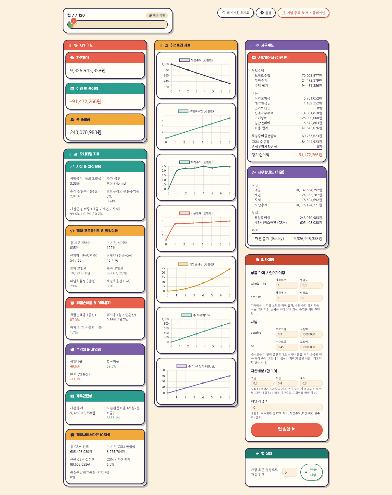

# 보험회사 운영 시뮬레이션 (Insurance Company Simulator)

턴제(월 단위, 기본 120턴/10년, 최대 600턴까지 설정 가능) 보험회사 경영 시뮬레이션 웹 애플리케이션입니다.  
플레이어는 보험사의 최고경영자(CEO)가 되어 매월 신계약 판매, 언더라이팅, 영업채널 수수료/마케팅, 자산 배분, 배당 결정을 내리며 최종 턴 시점의 **최종 순자산(자본총계)**을 극대화하는 것을 목표로 합니다.

---

## 🖥️ 게임 화면

매 턴 3단 구성의 대시보드에서 KPI, 모니터링 지표, 재무제표를 확인하고 의사결정을 내립니다. 각 패널은 드래그로 자유롭게 재배치할 수 있습니다.



---

## 📖 핵심 게임 시스템

### 1. 주요 의사결정 영역
- **상품 가격 및 언더라이팅**:
  - `whole_life` (종신보험): 사망보장 중심 상품. 언더라이팅을 강화하면 사망률이 감소하지만 승인율이 하락합니다.
  - `savings` (저축성보험): 5년(60턴) 만기 적립/이자부리 상품. 만기 시 원리금이 지급됩니다.
- **영업채널 관리**:
  - `captive` (전속설계사): 안정적인 판매량, 마케팅비 및 수수료율 민감도 반응.
  - `ga` (법인대리점): 높은 수수료율 민감도와 판매 생산성.
- **자산 배분 (신규 현금흐름 기준)**:
  - `deposit` (예금): 고정 안전 금리.
  - `bond` (채권): 시장금리 연동 이자수익.
  - `stock` (주식): 국면(Normal/Boom/Crisis)에 따른 마코프 체인 기반 확률적 고위험·고수익.
- **배당 정책**:
  - `dividend_payout`: 주주 배당금 지급 및 자본 관리.

### 2. 시뮬레이션 파이프라인 (매 턴)
```
1. 영업채널 역량 계산 (마케팅비, 수수료율)
2. 신계약 청약 및 인수심사(언더라이팅) 통과율 산출 -> 새 코호트 생성
3. 기존 코호트 전이 (사망, 해지, 만기금 지급 및 준비금 갱신)
4. 계약서비스마진(CSM) 최초 인식 및 롤포워드 (IFRS 17 방식)
5. 시장 상태 갱신 (금리 평균회귀 + 주가 레짐 마코프 체인)
6. 자산운용 수익 인식 및 신규 순현금흐름 자산 배분
7. 손익계산서(P&L) 및 재무상태표(B/S) 롤포워드 -> 순자산(Equity) 갱신
```

### 3. 회원 계정 및 게임 소유권

- 이메일/비밀번호로 회원가입·로그인하며, 게임 데이터는 계정별로 소유·보호됩니다.
- 로그인 상태는 30일 서버 세션 + `HttpOnly` 쿠키(`insurance_session`)로 유지되어, 새로고침이나 다른 기기에서도 이어서 플레이할 수 있습니다.
- CSRF 방어를 위해 double-submit 토큰(`insurance_csrf` 쿠키 + `X-CSRF-Token` 헤더)을 사용하며, 상태 변경 요청(POST/PUT/PATCH/DELETE)에 필요합니다. 프론트엔드는 자동으로 첨부합니다.
- 비밀번호는 Argon2id로 해시 저장되고, 로그인 실패는 15분/5회 제한(429)이 적용됩니다.
- 스키마 변경은 Alembic 마이그레이션으로 관리됩니다 (아래 "DB 마이그레이션" 참고).

### 4. 게임 종료 조건
- **정상 종료 (`completed`)**: 게임 생성 시 설정한 최종 턴 수(`game_length_turns`, 1~600, 기본 120턴/10년) 완주 시 종료.
- **파산 (`bankrupt`)**: 턴 종료 시점 순자산(자본총계) $\le$ 0 일 경우 즉시 파산 처리.
- **점수**: 마지막 플레이 턴의 순자산(자본총계).

---

## 🛠 기술 스택 & 아키텍처

- **Backend**: Python 3.11+, FastAPI, SQLModel (SQLAlchemy 2.0 + Pydantic), SQLite, Alembic(마이그레이션), Argon2(`argon2-cffi`, 비밀번호 해시)
- **Simulation Engine**: `backend/app/engine/` (DB/웹 의존성이 없는 순수 Python + NumPy 시뮬레이션 엔진, 계약서비스마진(CSM) 최초인식·롤포워드 포함)
- **Frontend**: Vue 3 (Composition API), Vite, Tailwind CSS v4(보드게임 테마 디자인 토큰), Pinia, Vue Router, Chart.js (`vue-chartjs`), `vuedraggable`(대시보드 패널 드래그 재배치), `@phosphor-icons/vue`
- **Containers**: Podman Compose / Docker Compose

---

## 🚀 빠른 시작 (Container)

권장 실행 환경은 `podman-compose` 또는 `docker-compose`입니다.

```bash
# 컨테이너 빌드 및 실행
podman-compose up --build
# 또는
docker-compose up --build
```

- **Frontend**: [http://localhost:5173](http://localhost:5173)  
  *(⚠️ 주의: 백엔드 CORS 설정에 따라 `127.0.0.1`이 아닌 `localhost`로 접속해야 합니다.)*
- **Backend API Docs (Swagger UI)**: [http://localhost:8000/docs](http://localhost:8000/docs)
- **Health Check**: [http://localhost:8000/health](http://localhost:8000/health)

종료:
```bash
podman-compose down
```

> ⚠️ **DB 스키마 변경 시 주의**: 기존 테이블의 컬럼 변경/삭제는 `create_all()`이 처리하지 않으므로 **반드시 Alembic 마이그레이션**을 작성·적용해야 합니다 (`alembic revision --autogenerate` 후 `alembic upgrade head`). 위의 "DB 마이그레이션" 절을 참고하세요.

---

## 💻 로컬 개발 환경 실행

### 1. 백엔드 (Backend)

```bash
cd backend

# 가상환경 생성 및 활성화
python3 -m venv .venv
source .venv/bin/activate

# 패키지 및 개발 의존성 설치
pip install -e ".[dev]"

# 개발 서버 실행
uvicorn app.main:app --reload --port 8000
```

### 2. 프론트엔드 (Frontend)

별도의 터미널에서 실행:

```bash
cd frontend

# 의존성 설치
npm install

# Vite 개발 서버 실행
npm run dev

# 프로덕션 빌드
npm run build
```

첫 접속 시 `/register`에서 계정을 만든 뒤 로그인하면 홈 화면에서 새 게임을 만들거나 과거 기록을 이어서 플레이할 수 있습니다.

---

## 🗄 DB 마이그레이션 (Alembic)

스키마는 Alembic으로 관리합니다. `init_db()`의 `create_all()`은 앱 시작 시 누락된 테이블을 채우는 역할만 하고, **기존 테이블의 컬럼 변경은 반드시 마이그레이션으로 수행**해야 합니다.

```bash
cd backend

# 현재 버전 확인
alembic current

# 스키마를 최신으로 갱신 (로컬: backend/data/simulator.db, Render: /app/data의 SQLite 파일)
alembic upgrade head

# 모델과 DB 스키마가 일치하는지 검증
alembic check
```

> 참고: 인증 기능 도입 이전에 생성된 기존 게임 데이터에는 소유자(`games.user_id`)가 없습니다. 소유자를 임의로 추정·배정하지 않으므로, 기존 게임이 있는 DB를 업그레이드하려면 데이터 이전을 먼저 수행해야 합니다(마이그레이션이 레거시 게임 행을 발견하면 의도적으로 실패하며 안내 메시지를 출력합니다). 개인 개발 DB는 그냥 삭제 후 재생성하는 것이 가장 간단합니다.

---

## 🔐 Render 배포 환경 변수

| 변수 | 값 | 설명 |
|---|---|---|
| `CORS_ALLOWED_ORIGINS` | `https://<frontend-host>` | 정확한 프론트엔드 origin만 허용 (와일드카드 금지) |
| `SESSION_COOKIE_SECURE` | `true` | HTTPS 환경에서만 쿠키 전송 |
| `SESSION_COOKIE_SAMESITE` | `none` | 프론트엔드↔백엔드 크로스사이트 쿠키 허용 |

배포 후 스키마 갱신은 Render shell에서 `cd backend && alembic upgrade head`를 실행합니다(영구 디스크의 SQLite 파일 대상). 재배포 후에도 사용자·세션·게임 데이터는 디스크의 SQLite에 유지됩니다.

---

## 🧪 테스트 실행

백엔드는 `pytest` 기반 단위 및 통합 테스트를, 프론트엔드는 `vitest` 기반 유틸리티 테스트를 제공합니다.

```bash
# 백엔드: 가상환경이 활성화된 상태에서
cd backend
pytest -v

# 또는 루트 디렉토리에서 바로 실행
backend/.venv/bin/pytest backend/tests -v

# 프론트엔드
cd frontend
npm run test
```

---

## 📡 API 엔드포인트 요약

| 메서드 | 엔드포인트 | 설명 |
|---|---|---|
| `POST` | `/auth/register` | 회원가입 (이메일/비밀번호, 세션 발급) |
| `POST` | `/auth/login` | 로그인 (세션 발급, 15분/5회 실패 제한) |
| `POST` | `/auth/logout` | 로그아웃 (세션 무효화 및 쿠키 만료) |
| `GET` | `/auth/me` | 현재 로그인 사용자 조회 (비로그인 401) |
| `POST` | `/games` | 새 게임 생성 (로그인 필요) |
| `GET` | `/games` | 내 게임 목록 조회 (로그인 필요) |
| `GET` | `/games/{id}` | 게임 상태 및 최신 재무 스냅샷 조회 (소유자만) |
| `GET` | `/games/{id}/config` | 게임 기본 설정(상품 및 채널 메타데이터) 조회 (소유자만) |
| `GET` | `/games/{id}/history` | 게임 전체 턴 재무 스냅샷 히스토리 조회 (소유자만) |
| `POST` | `/games/{id}/turn` | 의사결정 제출 및 다음 턴(1턴) 진행 (소유자만) |
| `DELETE` | `/games/{id}` | 게임 및 연관 데이터 삭제 (소유자만) |
| `GET` | `/health` | 서버 상태 점검 (인증 불필요) |

게임 API는 로그인하지 않으면 `401`을 반환하고, 다른 사용자의 게임에 접근하면 존재 여부를 노출하지 않도록 `404`를 반환합니다.

---

## 📂 프로젝트 디렉토리 구조

```
insurance_company_simulator/
├── backend/                      # FastAPI 백엔드 & 시뮬레이션 엔진
│   ├── app/
│   │   ├── api/                  # REST API 라우터 (/games, /auth)
│   │   ├── engine/               # 독립된 순수 Python 시뮬레이션 코어
│   │   ├── auth.py               # 비밀번호 해시, 세션/CSRF, 현재 사용자 의존성
│   │   ├── db.py                 # SQLite DB 세션 및 테이블 초기화
│   │   ├── models.py             # SQLModel 엔티티 정의 (사용자/세션/게임 등)
│   │   ├── repository.py         # DB 트랜잭션 및 엔진 연동 레포지토리
│   │   ├── schemas.py            # API 요청/응답 Pydantic 스키마
│   │   └── main.py               # FastAPI 애플리케이션 진입점
│   ├── migrations/               # Alembic 마이그레이션 (SQLite batch 모드)
│   ├── tests/                    # pytest 테스트 스위트 (엔진 및 API)
│   ├── pyproject.toml            # 파이썬 의존성 설정
│   └── Dockerfile
├── frontend/                     # Vue 3 SPA 프론트엔드
│   ├── src/
│   │   ├── api/                  # Axios HTTP 클라이언트 (세션 쿠키, CSRF 자동 첨부)
│   │   ├── components/           # UI 컴포넌트 (의사결정 패널, 드래그 가능 패널, 재무제표, 모니터링, 차트, KPI 카드 등)
│   │   ├── stores/               # Pinia 상태 관리 (게임, 인증)
│   │   ├── utils/                # 대시보드 레이아웃·인증 라우트 가드 등 유틸리티
│   │   ├── views/                # 화면 뷰 (게임 생성, 대시보드, 결과, 로그인, 회원가입)
│   │   └── main.js
│   ├── package.json
│   ├── vite.config.js
│   └── Dockerfile
├── docs/                         # 상세 기획 및 아키텍처 스펙 문서
│   ├── diagrams/                 # 게임 루프·전략 트레이드오프·턴 흐름 설명 다이어그램
│   ├── screenshots/              # README용 게임 화면 스크린샷
│   ├── simulation/               # 시뮬레이션 수식, CSM 방법론, 현실성 평가 및 로드맵
│   └── superpowers/              # 기능별 설계 스펙 및 구현 계획서
│       ├── specs/
│       └── plans/
├── docker-compose.yml            # 멀티 컨테이너 오케스트레이션 설정
├── CLAUDE.md                     # AI 어시스턴트 개발 가이드
└── README.md
```

---

## 📚 관련 문서
- [시뮬레이션 수식 및 아키텍처 명세서](docs/simulation/simulation_formulas.md)
- [CSM(계약서비스마진) 방법론](docs/simulation/csm_methodology.md)
- [보험 경영 현실성 평가 및 로드맵](docs/simulation/insurance_management_realism_and_roadmap.md)
- [Phase 1 설계 스펙](docs/superpowers/specs/2026-08-29-insurance-simulator-phase1-design.md)
- [Phase 1 구현 계획서](docs/superpowers/plans/2026-08-29-insurance-simulator-phase1.md)
