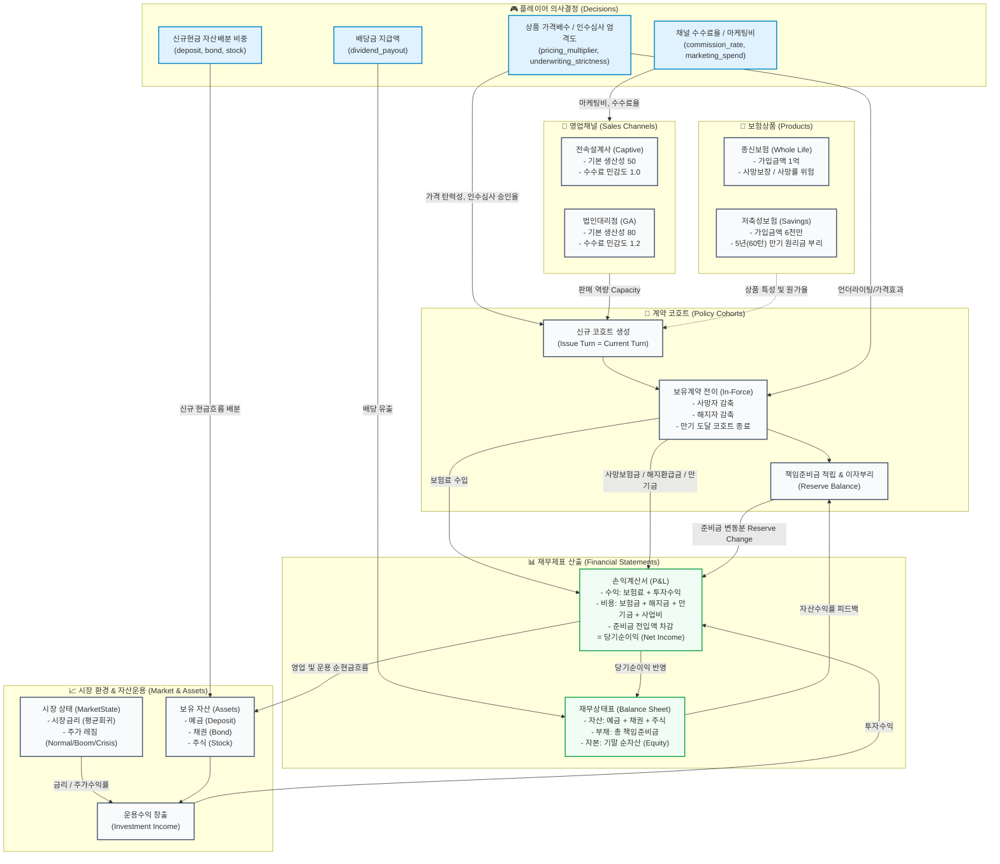

# 보험회사 시뮬레이션 수식 및 아키텍처 명세서 (Simulation Formulas & Architecture)

본 문서는 **보험회사 운영 시뮬레이션(Insurance Company Simulator)** 엔진에서 사용되는 모든 수식, 계산 로직, 그리고 **상품(Products)**, **영업채널(Sales Channels)**, **자산운용(Asset Allocation)**, **재무제표(P&L / B/S)** 간의 상호작용 관계를 상세히 기술합니다.

---

## 1. 전체 시스템 구조 및 상호작용 다이어그램

시뮬레이션은 매 턴(1개월)마다 **의사결정 $\to$ 신계약 창출 $\to$ 보유계약 갱신 $\to$ 시장 및 자산운용 $\to$ 재무제표 작성**의 피드백 루프로 작동합니다.

### 1.1 시스템 관계도 (Mermaid Diagram)



---

## 2. 신계약 발생 및 코호트 수 (Policy Cohorts)

### 2.1 영업채널 판매 역량 ($ChannelCapacity$)
각 채널의 월간 신계약 창출 역량은 기준 생산성에 **수수료율 유인 효과**와 **마케팅비 투입에 따른 체감 효과(제곱근 모델)**를 반영합니다.

$$\text{Capacity}(c) = \text{BaseProductivity}_c \times \left(1 + \text{Sensitivity}_c \times (\text{CommissionRate}_c - \text{BaseCommissionRate}_c)\right) \times \sqrt{\frac{\text{MarketingSpend}_c}{\text{ReferenceSpend}_c}}$$

- $c \in \{\text{captive}, \text{ga}\}$
- 전속설계사(Captive): $\text{BaseProductivity}=50$, $\text{BaseCommission}=30\%$, $\text{Sensitivity}=1.0$, $\text{ReferenceSpend}=1,000만 원$
- 법인대리점(GA): $\text{BaseProductivity}=80$, $\text{BaseCommission}=45\%$, $\text{Sensitivity}=1.2$, $\text{ReferenceSpend}=1,500만 원$

### 2.2 가격 탄력성 및 청약 건수 ($RawApplications$)
가격 배수($\text{Multiplier}$)가 높을수록 수요가 감소하며, 탄력도($\text{Elasticity} = 2.0$)가 적용됩니다.

$$\text{PriceElasticity}(p) = \text{Multiplier}_p^{-2.0}$$

$$\text{RawApplications}(p, c) = \text{Capacity}(c) \times \text{Split}(p, c) \times \text{PriceElasticity}(p)$$

- 채널-상품 분배율($\text{Split}$):
  - 종신보험(Whole Life): Captive 60%, GA 40%
  - 저축성보험(Savings): Captive 40%, GA 60%

### 2.3 언더라이팅 승인율 및 신규 코호트 생성 ($NewPolicies$)
언더라이팅 엄격도($\text{Strictness}_p \in [0, 1]$)가 높을수록 우량 계약만 인수되어 승인율이 감소합니다.

$$\text{ApprovalRate}(p) = 1.0 - 0.4 \times \text{Strictness}_p$$

$$\text{NewPolicies}(p, c) = \left\lfloor \text{RawApplications}(p, c) \times \text{ApprovalRate}(p) \right\rfloor$$

매 턴 $\text{NewPolicies} > 0$ 인 경우, 가입턴(`issue_turn = current_turn`), 초기보유수(`in_force_count = NewPolicies`), 초기준비금(`reserve_balance = 0`)을 갖는 새로운 `PolicyCohort`가 생성됩니다.

---

## 3. 보험료 산출 및 지급률 (사망보험금 / 만기보험금)

### 3.1 유효 원가율 및 건당 월 보험료
경과 기간($\text{Duration} = \text{CurrentTurn} - \text{IssueTurn}$)에 따른 노화/부리효과($1.03^{\text{years}}$)와 언더라이팅 할인 효과를 적용합니다.

$$\text{EffectiveCostRate}(p, t) = \text{BaseCostRate}_p \times (1.03)^{t/12} \times (1.0 - 0.3 \times \text{Strictness}_p)$$

$$\text{GrossPremiumPerPolicy}(p, t) = \text{UnitSize}_p \times \frac{\text{EffectiveCostRate}(p, t)}{12} \times (1 + \text{ExpenseLoading}_p) \times \text{Multiplier}_p$$

- **종신보험**: $\text{UnitSize}=1억 원$, $\text{BaseCost}=0.2\%/\text{년}$, $\text{Loading}=15\%$
- **저축성보험**: $\text{UnitSize}=6천만 원$, $\text{BaseCost}=2.5\%/\text{년}$, $\text{Loading}=8\%$

### 3.2 월 사망률 및 사망보험금 지급 ($DeathClaims$)
종신보험은 위험률에 따라 사망자가 발생하며, 사망자 수에 비례하여 가입금액 전액을 지급합니다. (저축성보험은 Phase 1에서 사망보장 제외)

$$\text{MonthlyDecrementRate}(p, t) = \begin{cases} \dfrac{\text{EffectiveCostRate}(p, t)}{12} & (p = \text{whole\_life}) \\ 0 & (p = \text{savings}) \end{cases}$$

$$\text{Deaths} = \text{InForceCount} \times \text{MonthlyDecrementRate}(p, t)$$

$$\text{DeathClaims} = \text{Deaths} \times \text{UnitSize}_p$$

### 3.3 저축성보험 만기 도달 및 만기보험금 지급 ($MaturityPayouts$)
저축성보험은 **60턴(5년)** 도달 시 만기가 되며, 해당 시점의 코호트 전체 적립금(책임준비금)을 계약자에게 전액 환급하고 코호트가 소멸합니다.

$$\text{MaturityPayouts} = \begin{cases} \text{ReserveBalance}_{\text{next}} & (p = \text{savings} \text{ and } \text{Duration} + 1 \ge 60) \\ 0 & (\text{기타}) \end{cases}$$

---

## 4. 해지율 (Lapse Rate) 및 책임준비금 (Reserve)

### 4.1 월 해지율 및 해지환급금 ($SurrenderPayouts$)
가격 배수($\text{Multiplier}$)가 높을수록 계약자의 가격 부담으로 인해 해지율이 지수($1.5$)로 상승합니다.

$$\text{MonthlyLapseRate}(p) = \frac{\text{BaseLapseRate}_p \times \text{Multiplier}_p^{1.5}}{12}$$

$$\text{Lapses} = \text{InForceCount} \times \text{MonthlyLapseRate}(p)$$

해지환급금은 현재 코호트의 건당 적립된 책임준비금에 비례하여 지급됩니다:

$$\text{ReservePerPolicy} = \frac{\text{ReserveBalance}}{\text{InForceCount}}$$

$$\text{SurrenderPayout} = \text{Lapses} \times \text{ReservePerPolicy}$$

### 4.2 보유계약 건수 갱신 ($InForceCount_{t+1}$)
$$\text{InForceCount}_{\text{next}} = \text{InForceCount} - \text{Deaths} - \text{Lapses}$$
*(잔여 계약수가 $0.01$ 이하로 떨어지면 코호트는 소멸 처리됩니다.)*

### 4.3 책임준비금 롤포워드 ($ReserveBalance_{t+1}$)
보험료 중 적립 비중, 해지/사망 환출액, 그리고 자산운용 수익률에 연동된 이자부리가 반영됩니다.

$$\text{DeathReserveRelease} = \text{Deaths} \times \text{ReservePerPolicy}$$

$$\text{CreditedRateMonthly} = \text{PortfolioReturnMonthly} \times \text{CreditedRateSpread}_p$$

$$\begin{aligned}
\text{ReserveBalance}_{\text{next}} = &\;\text{ReserveBalance} \\
&+ (\text{InForceCount} \times \text{GrossPremiumPerPolicy}) \times \text{ReserveAccrualRatio}_p \\
&- \text{SurrenderPayout} \\
&- \text{DeathReserveRelease} \\
&+ \text{ReserveBalance} \times \text{CreditedRateMonthly}
\end{aligned}$$

- **적립률($\text{ReserveAccrualRatio}$)**: 종신보험 60%, 저축성보험 90%
- **부리스프레드($\text{CreditedRateSpread}$)**: 종신보험 0.0 (무배당 고정), 저축성보험 1.0 (운용자산 수익률 100% 연동 부리)

---

## 5. 시장 환경 모델 및 자산 운용 수익

### 5.1 시장 상태 (금리 및 주가 레짐)
매 턴 확률적(Stochastic)으로 시장 환경이 갱신됩니다.

1. **시장금리 ($InterestRate$)**: 장기 목표금리($3.0\%$)로 평균회귀하는 랜덤워크
   $$\text{Rate}_{t+1} = \max\left(0, \;\text{Rate}_t + 0.1 \times (0.03 - \text{Rate}_t) + \mathcal{N}(0, 0.002^2)\right)$$

2. **주가 국면 ($StockRegime$)**: 3단계 마코프 체인
   - **전이 확률 행렬**:
     $$P = \begin{pmatrix} 
     \text{Normal} \to \text{Normal}: 0.94 & \text{Normal} \to \text{Boom}: 0.03 & \text{Normal} \to \text{Crisis}: 0.03 \\
     \text{Boom} \to \text{Normal}: 0.15 & \text{Boom} \to \text{Boom}: 0.85 & \text{Boom} \to \text{Crisis}: 0.00 \\
     \text{Crisis} \to \text{Normal}: 0.20 & \text{Crisis} \to \text{Boom}: 0.00 & \text{Crisis} \to \text{Crisis}: 0.80
     \end{pmatrix}$$
   - **레짐별 월 수익률 파라미터 ($\mu, \sigma$)**:
     - Normal: $\mu = +0.5\%$, $\sigma = 4.0\%$
     - Boom: $\mu = +1.5\%$, $\sigma = 5.0\%$
     - Crisis: $\mu = -3.0\%$, $\sigma = 8.0\%$
   $$\text{StockReturnRealized}_{t+1} = \mu_{\text{regime}} + \sigma_{\text{regime}} \times \mathcal{N}(0, 1)$$

### 5.2 자산별 월간 수익률
- **예금 수익률**: $\text{DepositReturn} = \dfrac{\max(0.001, \;\text{Rate}_{t+1} - 0.005)}{12}$
- **채권 수익률**: $\text{BondReturn} = \dfrac{\text{Rate}_{t+1}}{12}$
- **주식 수익률**: $\text{StockReturn} = \text{StockReturnRealized}_{t+1}$

### 5.3 투자수익 ($InvestmentIncome$) 및 자산 증식
$$\text{InvestmentIncome} = \text{Deposit} \times \text{DepositReturn} + \text{Bond} \times \text{BondReturn} + \text{Stock} \times \text{StockReturn}$$

$$\text{AssetsAfterReturns} = \begin{cases} 
\text{Deposit}' = \text{Deposit} \times (1 + \text{DepositReturn}) \\
\text{Bond}' = \text{Bond} \times (1 + \text{BondReturn}) \\
\text{Stock}' = \text{Stock} \times (1 + \text{StockReturn})
\end{cases}$$

$$\text{PortfolioReturnMonthly} = \frac{\text{InvestmentIncome}}{\text{AssetsTotal}_{\text{start}}}$$

### 5.4 신규 순현금흐름 배분 ($InvestNetCashflow$)
기존 자산 잔액을 전량 매매하지 않고, **이번 턴 발생한 신규 순현금흐름($\text{ToInvest}$)**만 플레이어의 목표 배분 비중에 따라 매수/매도합니다.

$$\text{ToInvest} = \text{NetCashflow} - \text{DividendPayout}$$

- **$\text{ToInvest} \ge 0$ (순유입/흑자 시)**:
  $$\begin{aligned}
  \text{Deposit}_{\text{final}} &= \text{Deposit}' + \text{Allocation}_{\text{deposit}} \times \text{ToInvest} \\
  \text{Bond}_{\text{final}} &= \text{Bond}' + \text{Allocation}_{\text{bond}} \times \text{ToInvest} \\
  \text{Stock}_{\text{final}} &= \text{Stock}' + \text{Allocation}_{\text{stock}} \times \text{ToInvest}
  \end{aligned}$$

- **$\text{ToInvest} < 0$ (순유출/적자 시)**: 자산 구성비에 비례하여 균등 인출
  $$\text{Asset}_{k, \text{final}} = \max\left(0, \;\text{Asset}'_k + \frac{\text{Asset}'_k}{\text{AssetsTotal}'} \times \text{ToInvest}\right)$$

---

## 6. 손익계산서 (P&L) 및 재무상태표 (Balance Sheet)

### 6.1 사업비 및 수수료 비용 산출
- **신계약 수수료**: 이번 턴 발생한 신계약의 초회 보험료에 수수료율을 곱하여 즉시 비용 인식
  $$\text{CommissionExpense} = \sum_{\text{new cohorts}} \text{PremiumIncome}_{\text{cohort}} \times \text{CommissionRate}_{\text{channel}}$$
- **마케팅비**: $\text{MarketingExpense} = \text{MarketingSpend}_{\text{captive}} + \text{MarketingSpend}_{\text{ga}}$
- **일반관리비(Opex)**: 전체 유지계약 건수에 따른 로그 비례 비용
  $$\text{Opex} = 5,000,000 \times \left(1 + 0.02 \times \ln(1 + \text{TotalInForce})\right)$$

### 6.2 손익계산서 (P&L) 수식 체계

| 항목 구분 | 세부 항목 | 산출 방식 |
|---|---|---|
| **(+) 영업수익** | 보험료수입 ($\text{PremiumIncome}$) | $\sum \text{Cohort Premium}$ |
| **(+) 운용수익** | 투자수익 ($\text{InvestmentIncome}$) | $\sum (\text{Asset}_i \times \text{Return}_i)$ |
| **(-) 지급보험금** | 사망보험금 ($\text{DeathClaims}$) | $\sum (\text{Deaths} \times \text{UnitSize})$ |
| **(-) 해약환급금** | 해지환급금 ($\text{SurrenderPayouts}$) | $\sum (\text{Lapses} \times \text{ReservePerPolicy})$ |
| **(-) 만기보험금** | 만기지급금 ($\text{MaturityPayouts}$) | 만기 도달 코호트 적립금 합계 |
| **(-) 사업비/비용** | 신계약수수료 ($\text{CommissionExpense}$) | 신계약 초회보험료 $\times$ 수수료율 |
| | 마케팅비 ($\text{MarketingExpense}$) | 채널별 마케팅 집행액 합계 |
| | 일반관리비 ($\text{Opex}$) | $500만 \times (1 + 0.02 \ln(1 + N))$ |
| **(-) 책임준비금전입액** | 준비금 변동분 ($\text{ReserveChange}$) | $\text{TotalReserve}_{\text{end}} - \text{TotalReserve}_{\text{start}}$ |
| **(=) 당기순이익** | **$\text{NetIncome}$** | **수익 합계 - 비용 합계 - 준비금전입액** |

$$\begin{aligned}
\text{NetIncome} = &\;(\text{PremiumIncome} + \text{InvestmentIncome}) \\
&- (\text{DeathClaims} + \text{SurrenderPayouts} + \text{MaturityPayouts}) \\
&- (\text{CommissionExpense} + \text{MarketingExpense} + \text{Opex}) \\
&- \text{ReserveChange}
\end{aligned}$$

### 6.3 재무상태표 (Balance Sheet) 롤포워드 및 자본 등식

```
========================================================================
                      재무상태표 (Balance Sheet)
------------------------------------------------------------------------
       [ 자 산 (Assets) ]             |      [ 부 채 (Liabilities) ]
  1. 예금 (Deposit Balance)          |  1. 책임준비금 (Total Reserve)
  2. 채권 (Bond Balance)             |----------------------------------
  3. 주식 (Stock Balance)            |       [ 자 본 (Equity) ]
                                     |  1. 기말 순자산 (Equity)
------------------------------------------------------------------------
  자산총계 = Deposit + Bond + Stock   |  부채와 자본총계 = Reserve + Equity
========================================================================
```

$$\text{AssetsTotal} = \text{Deposit}_{\text{final}} + \text{Bond}_{\text{final}} + \text{Stock}_{\text{final}}$$

$$\text{Liabilities} = \text{TotalReserve}_{\text{end}} = \sum_{\text{cohorts}} \text{ReserveBalance}_{\text{next}}$$

$$\text{Equity}_{t} = \text{Equity}_{t-1} + \text{NetIncome} - \text{DividendPayout}$$

$$\text{AssetsTotal} \equiv \text{Liabilities} + \text{Equity}$$

---

## 7. 주요 파라미터 및 기본값 일람표 (Configuration Reference)

### 7.1 상품 기본 설정 (`ProductConfig`)
| 파라미터명 | 종신보험 (`whole_life`) | 저축성보험 (`savings`) | 설명 |
|---|---|---|---|
| `unit_size` | 100,000,000 원 | 60,000,000 원 | 계약 1건당 기준 보장/가입 금액 |
| `base_cost_rate_annual` | 0.002 (0.2%/년) | 0.025 (2.5%/년) | 기본 위험률(사망) / 부리 원가율 |
| `expense_loading` | 0.15 (15%) | 0.08 (8%) | 부가보험료율 (사업비 로딩) |
| `base_lapse_rate_annual`| 0.05 (5%/년) | 0.08 (8%/년) | 기본 연간 해지율 |
| `reserve_accrual_ratio` | 0.60 (60%) | 0.90 (90%) | 보험료 중 순수 책임준비금 적립 비중 |
| `credited_rate_spread`  | 0.0 | 1.0 | 운용자산 수익률 부리 스프레드 |
| `maturity_turns`        | `None` (종신) | 60 (5년) | 만기 턴 수 |

### 7.2 영업채널 기본 설정 (`ChannelConfig`)
| 파라미터명 | 전속설계사 (`captive`) | 법인대리점 (`ga`) | 설명 |
|---|---|---|---|
| `base_productivity` | 50.0 건/월 | 80.0 건/월 | 기준 생산성 |
| `base_commission_rate`| 0.30 (30%) | 0.45 (45%) | 기본 신계약 수수료율 |
| `commission_sensitivity`| 1.0 | 1.2 | 수수료율 변동에 대한 판매 민감도 |
| `reference_spend` | 10,000,000 원 | 15,000,000 원 | 마케팅비 기준액 (체감 효과 기준점) |

### 7.3 거시경제 및 시장 파라미터
| 파라미터명 | 기본값 | 설명 |
|---|---|---|
| `LONG_RUN_RATE` | 0.03 (3.0%) | 장기 목표 시장금리 |
| `RATE_REVERSION_SPEED` | 0.1 | 금리 평균회귀 속도 계수 |
| `RATE_NOISE_STD` | 0.002 (0.2%) | 월별 금리 랜덤워크 표준편차 |
| `DEPOSIT_RATE_SPREAD` | 0.005 (0.5%) | 시장금리 대비 예금금리 할인 폭 |
| `GAME_LENGTH_TURNS` | 120 | 총 게임 턴 수 (120개월 = 10년) |
| `INITIAL_CAPITAL_DEFAULT`| 10,000,000,000 원 | 기본 초기 자본금 (100억 원) |

---

## 8. 플레이어 시계열 모니터링 지표 체계 및 산출식 (Monitoring KPIs)

운영자(플레이어)가 턴 진행에 따라 상태를 파악하고 전략적 판단을 내릴 수 있도록 제공되는 권장 핵심 관측 지표입니다.

### 8.1 거시 시장 및 자산운용 동향 지표
1. **시장금리 추이 ($r_t$)**: 시장금리 수준 및 장기 기대금리($3\%$)와의 괴리도.
2. **주식 국면 및 실현수익률 ($\text{Regime}_t, \text{StockReturn}_t$)**: 현재 국면(Normal/Boom/Crisis)의 지속 확률 및 실현 월 수익률.
3. **포트폴리오 총 운용수익률 ($\text{PortfolioReturn}_t$)**:
   $$\text{PortfolioReturn}_t = \frac{\text{InvestmentIncome}_t}{\text{AssetsTotal}_{t-1}}$$
4. **자산군별 비중 구성비**:
   $$\text{Weight}_k = \frac{\text{Asset}_k}{\text{AssetsTotal}} \quad (k \in \{\text{deposit}, \text{bond}, \text{stock}\})$$

### 8.2 계약 포트폴리오 및 영업 성과 지표
1. **총 및 상품별/채널별 보유계약수 ($\text{InForceCount}$)**:
   $$\text{TotalInForce} = \sum_{\text{cohorts}} \text{InForceCount}_c$$
2. **월간 신계약 건수 ($\text{NewPolicies}$)**: 채널별, 상품별 신규 가입 규모.
3. **보험료 수입 구조 분해**:
   - 초회 보험료 (New Business Premium): 당해 턴 신규 유입 코호트의 보험료
   - 계속 보험료 (Renewal Premium): 기존 유지 코호트의 보험료
4. **채널 효율성 ($E_c$)**:
   $$E_c = \frac{\text{신계약 초회보험료}_c}{\text{CommissionExpense}_c + \text{MarketingSpend}_c}$$

### 8.3 위험 손해율 및 계약 유지 지표
1. **위험손해율 (Loss Ratio)**:
   $$\text{LossRatio} = \frac{\text{DeathClaims}}{\text{PremiumIncome}_{\text{whole\_life}}}$$
2. **월간/연환산 해지율 (Lapse Ratio)**:
   $$\text{LapseRatio}_{\text{monthly}} = \frac{\sum \text{Lapses}}{\text{TotalInForce}}, \quad \text{LapseRatio}_{\text{annual}} \approx \text{LapseRatio}_{\text{monthly}} \times 12$$
3. **해지 및 만기 유출액 비율**:
   $$\text{SurrenderRatio} = \frac{\text{SurrenderPayouts} + \text{MaturityPayouts}}{\text{PremiumIncome}}$$

### 8.4 수익성 및 사업비 지표
1. **사업비율 (Expense Ratio)**:
   $$\text{ExpenseRatio} = \frac{\text{CommissionExpense} + \text{MarketingExpense} + \text{Opex}}{\text{PremiumIncome}}$$
2. **합산비율 (Combined Ratio)**:
   $$\text{CombinedRatio} = \frac{\text{Claims} + \text{Surrenders} + \text{Expenses}}{\text{PremiumIncome}}$$
   *(100% 미만이면 순수 보험영업 흑자, 100% 초과 시 투자수익에 의존하는 구조임을 의미)*
3. **자기자본이익률 (ROE - 연환산)**:
   $$\text{ROE}_{\text{annual}} = \left(\frac{\text{NetIncome}_t}{\text{Equity}_{t-1}}\right) \times 12$$

### 8.5 재무 건전성 지표
1. **자본총계/순자산 ($\text{Equity}$)**: 회사의 생존 및 최종 게임 스코어.
2. **자본완충비율 (Solvency Buffer Proxy)**:
   $$\text{SolvencyProxy} = \frac{\text{Equity}}{\text{TotalReserve}}$$

---

## 9. 의사결정 조정 요소(Decision Controls) 가이드

| 의사결정 변수 | 조정 범위 | 상향(증가) 시 긍정적 효과 | 상향(증가) 시 부정적 효과 / 위험 | 추천 운영 전략 |
|---|---|---|---|---|
| **상품 가격 배수 (`pricing_multiplier`)** | $0.5 \sim 2.0$ | 건당 월 보험료 수입 및 마진율 증가 | 수요 급감 (탄력도 $-2.0$), 기존 계약 해지율 상승 ($1.5$승) | 시장 지배력이 높거나 역선택 방지가 필요할 때 점진적 상향, 성장기에는 $1.0$ 근처 유지 |
| **언더라이팅 엄격도 (`underwriting_strictness`)** | $0.0 \sim 1.0$ | 경험 사망률 최대 30% 개선 (손해율 방어) | 신계약 승인율 최대 40% 탈락 (규모 성장 둔화) | 종신보험 판매 시 사망률 증가 구간에서 엄격도를 높여 손해율 안정화 |
| **채널 수수료율 (`commission_rate`)** | $0.1 \sim 0.8$ | 채널 영업 유인 극대화 $\to$ 신계약 판매 급증 | 초회 수수료 비용 즉시 증가로 단기 손익 악화 | 신계약 확장이 필요할 때 인상하되, GA 채널은 민감도가 높으므로 자본 여력 내에서 집행 |
| **채널 마케팅비 (`marketing_spend`)** | $0 \sim$ 수천만 | 인지도 개선 및 채널 생산성 확장 | 제곱근 체감 효과로 과도한 집행 시 현금 낭비 | 기준 집행액($1,000 \sim 1,500만$) 주변에서 최적 효율을 탐색하며 집행 |
| **자산 배분 (`asset_allocation`)** | 합계 $1.0$ | 주식: 호황기 초과수익 / 채권·예금: 안정적 이자 | 주식: 위기 국면 시 대규모 손실 / 채권·예금: 인플레이션/고수익 기회비용 | Normal/Crisis 시 채권·예금 비중 확대, Boom 국면 진입 시 주식 비중 전술적 확대 |
| **배당금 지급 (`dividend_payout`)** | $0 \sim$ 잉여금 | 주주 환원 및 자본 효율성(ROE) 제고 | 기말 순자산(Equity) 감소로 파산 위험 완충력 축소 | 자본금이 충분하고(파산 위험 없음) 잉여현금흐름이 안정적일 때 제한적 지급 |

